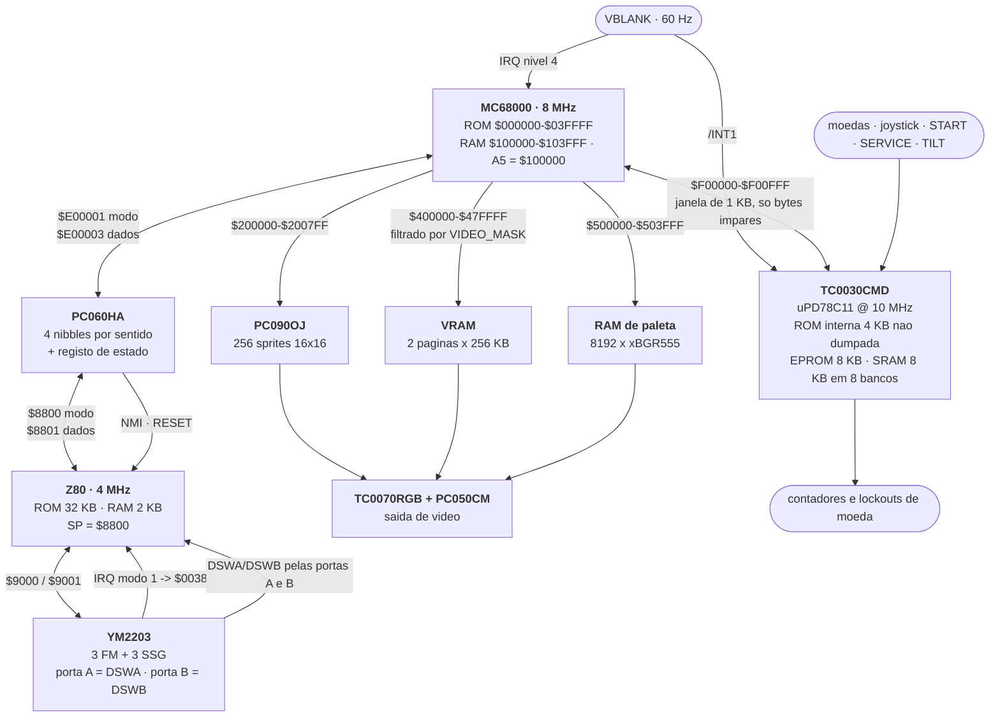
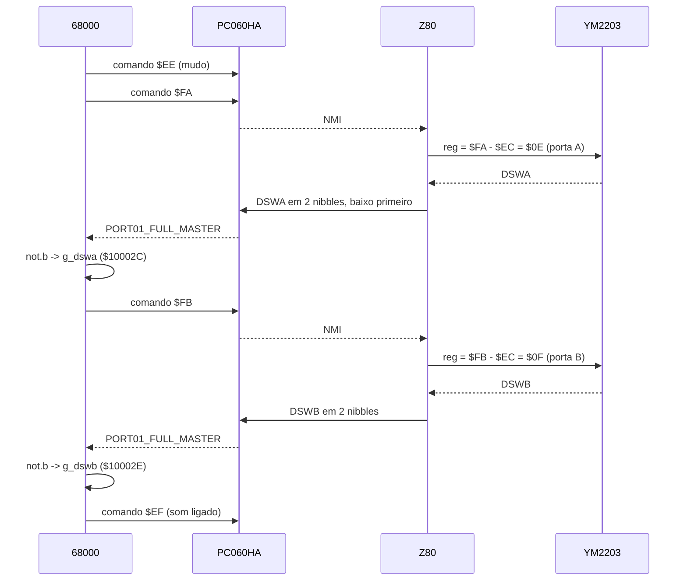

# 01 — A placa

O hardware do Volfied (Taito, 1989), set `volfied` — *Volfied (World, rev 1)*: três
processadores, cinco chips personalizados da Taito, três osciladores, e o caminho que cada
sinal faz entre eles.

**Autoridade dos endereços.** A fonte de verdade é
[`reference/HARDWARE_GROUND_TRUTH.md`](../reference/HARDWARE_GROUND_TRUTH.md). Este
documento não a repete: acrescenta-lhe o *porquê* de cada bloco e o que o código real faz
com ele. Todo o endereço citado aqui foi reconferido na listagem ou em `build/maincpu.bin`
enquanto este texto era escrito.

**O que este documento não cobre.** O mapa de endereços faixa a faixa, o layout dos bits da
VRAM e a divisão da RAM principal estão em
[`docs/02-mapa-de-memoria.md`](02-mapa-de-memoria.md). O interior do C-Chip — as oito
tarefas, o handler de frame, o formato dos dados de ronda — está em
[`docs/04-c-chip.md`](04-c-chip.md). O material bruto da fase de anotação, com as dúvidas
por resolver de cada agente, está em [`docs/ACHADOS_ANOTACAO.md`](ACHADOS_ANOTACAO.md).

---

## 1. Panorama

| Bloco | Peça | Relógio | Papel |
|---|---|---|---|
| CPU principal | MC68000 | 8 MHz (32 MHz ÷ 4) | o jogo inteiro: lógica, vídeo, preenchimento de área |
| CPU de som | Zilog Z80 | 4 MHz (32 MHz ÷ 8) | driver de música e efeitos |
| Protecção / I/O | **TC0030CMD** ("C-Chip") | 10 MHz (20 MHz ÷ 2) | entradas, contadores de moeda, tabelas de dados, protecção |
| Sprites | **PC090OJ** | — | 256 sprites de 16×16 a 4 bpp |
| Latch de som | **PC060HA** (CIU) | — | canal bidireccional 68000 ↔ Z80, mais NMI e RESET do Z80 |
| Saída de cor | **TC0070RGB** + **PC050CM** | — | RAM de paleta → vídeo analógico |
| Som | YM2203 (OPN) | 4 MHz | 3 canais FM + 3 SSG + 2 portas de I/O de 8 bits |
| VRAM | 12 × MB-81461 | — | camada bitmap (ver §11, ponto 6) |
| PROMs | MB7116H + MB7124E | — | 512 B cada; nenhuma é usada pelo MAME |

Osciladores: **32 MHz**, **26.686 MHz**, **20 MHz**. Os dois primeiros divisores estão
declarados no driver — `CPU_CLOCK = 32_MHz_XTAL / 4` e `SOUND_CPU_CLOCK = 32_MHz_XTAL / 8`,
e `TAITO_CCHIP(config, m_cchip, 20_MHz_XTAL / 2)` com o comentário "20MHz OSC next to
C-Chip". **O de 26.686 MHz não é usado por nada no driver**, que se limita a declarar
`set_refresh_hz(60)`; a que serve na placa e qual é a temporização exacta do varrimento não
está documentado por nenhuma fonte que este projecto tenha.

Ecrã: bitmap de 320×256 (`set_size(320, 256)`), área visível `0–319 × 8–247`, ou seja
320×240 (`set_visarea`), 60 Hz, e o driver declara **`ROT270`** — o monitor está fisicamente
rodado, portanto o resultado é retrato: 240 de largura por 320 de altura. A rotação não é
cosmética — implica que o eixo de 0..319 da VRAM (a *coluna*) seja o eixo vertical do
monitor e o de 0..255 (a *linha*) seja o horizontal. Todo o código do jogo raciocina em
coordenadas de VRAM, nunca de monitor.

Uma nota de escala que ajuda a ler tudo o resto: `config.set_maximum_quantum(from_hz(1200))`
em [`reference/mame/volfied.cpp`](../reference/mame/volfied.cpp) obriga o emulador a
intercalar as três CPUs 1200 vezes por segundo — 20 fatias por frame. Não é decoração: as
três conversam por memória partilhada e por latches sem semáforo nenhum.

---

## 2. Fluxo entre as CPUs



Quatro observações que este diagrama torna óbvias e que explicam metade do código do jogo:

1. **Os DIP switches não estão ligados ao 68000.** Estão nas portas A e B do YM2203, que só
   o Z80 consegue ler. O 68000 tem de os *pedir* ao Z80 através do PC060HA — ver §7.2. É
   por isso que existe `snd_read_dipswitches` (`$007372`) e que `reset_entry` a chama cinco
   vezes seguidas (`$00151E`, `$001548`, `$00155E`, `$00156E`, `$001574`) — uma por cada
   passo da máquina de estados de quatro fases que a rotina implementa.
2. **Os controlos também não estão ligados ao 68000.** Passam todos pelo C-Chip, que os
   copia para a SRAM partilhada uma vez por frame.
3. **O mesmo VBLANK interrompe duas CPUs.** O 68000 no nível 4 e o uPD78C11 no `/INT1`. Os
   dois trabalham sobre o mesmo frame, e é isso — e só isso — que sincroniza o handshake da
   SRAM partilhada. Não há semáforo de hardware nenhum.
4. **Nada volta do vídeo para o 68000 excepto um byte.** A leitura de `$D00000` devolve
   estado de colisão gerado por hardware (§9.4). É a única realimentação do subsistema
   gráfico.

---

## 3. As três CPUs

### 3.1 MC68000 @ 8 MHz

Faz tudo o que é jogo. Reset em `$0014B8`, com SSP `$00103FFE` (topo da RAM principal). As
duas primeiras instruções fixam o estado do vídeo *antes* de qualquer outra coisa, e a
terceira estabelece a convenção que torna a listagem legível
([`src/main68k/reset_and_dipswitch_setup.asm`](../src/main68k/reset_and_dipswitch_setup.asm)):

```
reset_entry:                                            ; $0014B8
        move.w  #$0,VIDEO_CTRL                          ; $0014B8  33fc000000d00000
        move.w  #$FFFF,VIDEO_MASK                       ; $0014C0  33fcffff00600000
        lea.l   g_base,a5                               ; $0014C8  4bf900100000
        lea.l   g_base,a0                               ; $0014CE  41f900100000
        lea.l   g_coin1_credits,a1                      ; $0014D4  43f900100002
        move.w  #$0,(a0)                                ; $0014DA  30bc0000
        move.w  #$1FFF,d0                               ; $0014DE  303c1fff
loc_0014E2:
        move.w  (a0)+,(a1)+                             ; $0014E2  32d8
        subq.w  #$1,d0                                  ; $0014E4  5340
        bne.b   loc_0014E2                              ; $0014E6  66fa
```

A limpeza da RAM é uma cópia em cascata: zera a primeira word e propaga-a 8191 vezes, o que
apaga os 16 KB inteiros. **A partir daqui `A5` vale `$100000` durante todo o jogo** e todo o
acesso a variáveis globais é `$xx(a5)`.

O jogo corre quase todo *dentro* da interrupção. O laço principal, em `$00161C`, é literalmente
duas instruções:

```
loc_00161C:
        bsr.w   vram_deferred_cmd_dispatch              ; $00161C  610046b8
        bra.b   loc_00161C                              ; $001620  60fa
```

### 3.2 Z80 @ 4 MHz

Só faz som. ROM de 32 KB em `$0000–$7FFF`, RAM de 2 KB em `$8000–$87FF`. O reset transborda
para o slot do `RST $08` — os primeiros catorze bytes de `build/audiocpu.bin` são
`f3 ed 56 3e 05 32 00 88 32 01 88 c3 81 01`, ou seja
([`src/sound_z80/sound.asm`](../src/sound_z80/sound.asm)):

```
reset_entry:
        di                              ; $0000  F3
        im      1                       ; $0001  ED 56
        ld      a,$05                   ; $0003  3E 05
        ld      (PC060HA_PORT),a        ; $0005  32 00 88
        ld      (PC060HA_COMM),a        ; $0008  32 01 88   <- ocupa o vector RST $08
        jp      loc_0181                ; $000B  C3 81 01
```

O modo 5 do PC060HA é "desligar a NMI" (§7). A primeira coisa que o Z80 faz é calar o latch
que o pode interromper. Em `$0181` põe o modo 0, lê duas vezes `$8801` para esvaziar o
latch, faz `ld sp,$8800` (a pilha arranca uma posição acima do topo da RAM e cresce para
baixo) e limpa `$8000–$87FF`.

`RST $10` a `RST $30` são oito `nop` cada — não usados. `RST $38` é o IRQ do modo 1, que vem
do YM2203, e é um `jp $0255`. `$0066` é a NMI, que vem do PC060HA.

### 3.3 uPD78C11 dentro do C-Chip @ 10 MHz

Entra por uma tabela de despacho de oito entradas no início da EPROM externa. A entrada 4
(`$200C` → `$214F`) é o arranque: programa as direcções dos três portos, copia uma vez as
entradas para a janela partilhada, escreve `MKL = $D7` e faz `ei`. Depois:

```
loc_217A:
        jr      loc_217A                ; $217A: FF
```

**O programa principal do C-Chip é um salto sobre si próprio.** Tudo o que o chip faz
acontece dentro da interrupção de frame. Ver §8 e
[`docs/04-c-chip.md`](04-c-chip.md).

---

## 4. Relógios, interrupções e o ritmo do frame

| Fonte | Destino | Vector / linha | Notas |
|---|---|---|---|
| VBLANK | 68000 | autovector IRQ 4; vector 28 em `$000070` = `$00000400` | `HOLD_LINE` no MAME |
| VBLANK | uPD78C11 | `/INT1` → vector `$0010` da ROM interna | asserção e limpeza no mesmo instante (temporizador de atraso zero) |
| YM2203 | Z80 | modo 1 → `$0038` | um `jp $0255` |
| PC060HA | Z80 | NMI (`$0066`) e linha de RESET | ver §7 |

Nenhuma outra interrupção é usada. Os vectores 2–11 do 68000 apontam para `$0011xxxx`, fora
do mapa de memória — restos dos handlers do sistema de desenvolvimento da Taito deixados na
EPROM final; ver [`docs/02-mapa-de-memoria.md` §2.2](02-mapa-de-memoria.md).

O handler de VBLANK, em [`src/main68k/irq_vblank_dispatch.asm`](../src/main68k/irq_vblank_dispatch.asm),
é a espinha dorsal do jogo inteiro:

```
irq4_vblank_handler_000400:
        ori.w   #$F00,sr                                ; $000400  007c0f00
        movem.l d0-d7/a0-a4/a6,-(a7)                    ; $000404  48e7fffa
        move.b  d0,SPRITE_CTRL_B                        ; $000408  13c000700001
        jsr     (vblank_service).l                      ; $00040E  4eb9000027da
        move.w  VIDEO_CTRL,$5A(a5)                      ; $000414  3b7900d00000005a
```

Por ordem: mascara interrupções, salva o contexto, escreve no `sprite_ctrl` do PC090OJ o
`d0` do código interrompido (§6.3 — não é um bug isolado, é um padrão), corre a animação de
paleta, e **guarda o estado de colisão lido do hardware em `$10005A`**. Depois despacha a
máquina de estados de topo por uma tabela de saltos de quatro entradas em `$00046E`, e
termina em `$000476` com `jsr sys_data_out_tick` / `movem.l (a7)+` / `rte`.

---

## 5. Como cada bloco é endereçado

O 68000 é a única CPU com barramento externo largo, e o mapa é esparso: um bloco por linha
de selecção. O detalhe está em [`docs/02-mapa-de-memoria.md`](02-mapa-de-memoria.md); o que
interessa aqui é quanto código toca cada bloco. Contagem de **acessos absolutos** por
rotina, tirada de `build/m68k_map.json` (que cobre a ROM inteira):

| Bloco | Endereços | Rotinas que lhe tocam | Offsets distintos |
|---|---|---|---|
| PC090OJ, RAM de sprites | `$200000–$203FFF` | 68 | 46 |
| PC090OJ, `sprite_ctrl` | `$700000` | 4 | 1 |
| VRAM | `$400000–$47FFFF` | **3** | 2 |
| Paleta | `$500000–$503FFF` | 28 | 34 |
| `VIDEO_MASK` | `$600000` | 15 | 1 |
| `VIDEO_CTRL` | `$D00000` | 4 | 2 |
| PC060HA | `$E00000–$E00003` | 6 | 3 |
| C-Chip | `$F00000–$F00FFF` | 25 | 24 |

O número que salta à vista é o da VRAM: **três**. São
[`vram_clear_page0`](../src/main68k/vram_ctrl_and_clear.asm) (`$00148C`), `vram_clear_page1`
(`$0014A2`) e o editor de objectos de desenvolvimento. Todo o resto do desenho passa por um
ponteiro guardado em `$10006A`, que só toma dois valores em toda a ROM — `$400000` e
`$440000` — escritos em sete sítios (`$001524`, `$003D44`, `$003D5E`, `$003E9E`, `$003EBA`,
`$003EEE`, `$003FB6`). É a diferença entre uma placa com duplo buffer e uma placa com **uma
página por jogador**.

Para contrastar: a região de tiles `$080000–$0FFFFF` tem **zero** acessos absolutos. É
sempre alcançada por `addi.l #TILE_ROM,d0` depois de `lsl.l #$5,d0` — o índice de tile vezes
32 ([`src/main68k/vram_tilemap_blit.asm`](../src/main68k/vram_tilemap_blit.asm), `$007080` e
`$007082`; o mesmo par repete-se em `$0070D4`/`$0070D6`, `$0072BE`/`$0072C0` e
`$00731A`/`$00731C`).

---

## 6. PC090OJ — o gerador de sprites

### 6.1 O que faz e porquê está lá

O PC090OJ é o único caminho que a placa tem para pôr uma imagem *por cima* da camada
bitmap. E como não existe camada de tiles nenhuma — `screen_update` é literalmente
`refresh_pixel_layer()` seguido de `pc090oj->draw_sprites()` —, tudo o que não seja o campo
de jogo é sprite. **Incluindo o texto.** Em
[`src/main68k/txt_message_renderer.asm`](../src/main68k/txt_message_renderer.asm):

```
        move.b  (a0)+,d0                                ; $001AE2  1018
        tst.b   d0
        beq.b   loc_001B06                              ; $00 termina a string
        cmpi.b  #$20,d0
        beq.b   loc_001B02                              ; espaco: so avanca X
        addi.w  #$FFE0,d0                               ; $001AEE  0640ffe0  -> code = ASCII - $20
        move.w  d0,$4(a1)                               ; $001AF2  33400004
        move.w  d3,(a1)                                 ; atributo
        move.w  d4,$2(a1)                               ; Y
        move.w  d5,$6(a1)                               ; X
        addq.w  #$8,a1                                  ; $001B00  5049
```

O chip trata 256 sprites de 8 bytes cada, com tiles de 16×16 a 4 bpp (128 bytes por tile;
768 KB de ROM de sprite dão 6144 tiles, dentro da máscara de 13 bits do campo de código).

### 6.2 O registo de 8 bytes

Formato confirmado contra [`reference/mame/pc090oj.cpp`](../reference/mame/pc090oj.cpp) e
contra o emissor do jogo, `spr_emit_metasprite` (`$008D8C`,
[`src/main68k/spr_metasprite_engine.asm`](../src/main68k/spr_metasprite_engine.asm)), que
escreve exactamente nesta ordem com quatro `move.w d,(a1)+`:

| Offset | Conteúdo |
|---|---|
| `+0` | atributo: b15 flip Y, b14 flip X, b3–b0 banco de cor |
| `+2` | Y (9 bits, `& $1FF`) |
| `+4` | código do tile (13 bits, `& $1FFF`) |
| `+6` | X (9 bits, `& $1FF`) |

Pontos práticos para quem reimplementar:

- **A RAM mapeada é de 16 KB (`$200000–$203FFF`) mas só os primeiros `$800` bytes são
  varridos** (`PC090OJ_ACTIVE_RAM_SIZE = 0x800`). Empiricamente, o maior offset de sprite
  que a ROM usa em endereçamento absoluto é `SPRITE_RAM+$778`; o único acesso acima de `$800`
  é ao registo de controlo em `$201BFE`.
- **X e Y são tratados como sinalizados**: `if (x > 0x140) x -= 0x200;` e o mesmo para Y.
  Daí a convenção do jogo para esconder um sprite: escrever `$180` na word de Y. 384 é maior
  que 320, portanto vira −128. `spr_emit_metasprite` fá-lo directamente para uma entrada
  vazia (`move.w #$180,$2(a1)` em `$008DE0`), e `spr_clear_to_end` (`$0145D0`) enche a lista
  de sprites, até `$200730`, com longs `$00000180`.
- **Não há duplo buffer de RAM de sprite.** O PC090OJ suporta-o (`m_use_buffer` +
  `eof_callback`) mas o driver do Volfied não o activa: o hardware desenha o que estiver na
  RAM naquele instante.
- **Prioridade.** O Volfied instala um `colpri_cb` que devolve `pri_mask = 0` — sprites por
  cima de tudo, sem máscara contra a bitmap. Com o callback instalado, o MAME percorre a
  lista **do sprite 0 para o 255**, o que faz do *último* sprite o que fica por cima. O
  cabeçalho do próprio `pc090oj.cpp` (nota herdada do Raine) diz o contrário: "First sprite
  has *highest* priority". A contradição está na fonte e não foi resolvida aqui.

### 6.3 `sprite_ctrl` (`$700000`) — um strobe, não um registo

O banco de cor dos sprites sai de

```c
sprite_colbank = 0x100 | ((sprite_ctrl & 0x3c) << 2);
```

ou seja `$100`, `$110`, … `$1F0`: 16 bancos possíveis, `$10` entradas de paleta cada.

**O jogo nunca programa este registo.** Há sete instruções na ROM inteira que escrevem em
`$700001`, distribuídas por quatro rotinas, e todas são `move.b d0,SPRITE_CTRL_B` com o `d0`
que calhar estar no registo:

| Endereço | Rotina | Que `d0` |
|---|---|---|
| `$000408` | `irq4_vblank_handler_000400` (`$000400`) | o do código interrompido, seja ele qual for |
| `$00153A`, `$00154E`, `$001558`, `$001568` | `reset_entry` (`$0014B8`) | o que a chamada imediatamente anterior deixou no registo |
| `$013FA8` | `selftest_rom_error_halt` (`$013ED8`) | idem |
| `$01438E` | `test_frame_delay` (`$01438A`) | idem |

Nas duas últimas a escrita está *dentro* de um laço de espera — em `test_frame_delay` são
65536 voltas — e o efeito pretendido é o ciclo de barramento, não o valor. Em nenhum dos sete
sítios há uma instrução que calcule um valor para este registo.

O jogo compensa de forma sistemática. **Todas as rotinas de carga de paleta de sprite
escrevem o mesmo bloco de cores 16 vezes, com passo `$200` bytes** — 256 entradas, que é
exactamente a distância entre dois `sprite_colbank` consecutivos. Em
[`src/main68k/pal_bank_loaders.asm`](../src/main68k/pal_bank_loaders.asm):

```
pal_load_bank_2020:
        lea.l   PALETTE+$2020,a1                        ; $00137A  43f900502020
        moveq   #$10,d7                                 ; $001380  7e10       16 copias
loc_001382:
        movea.l a1,a0
        move.w  #$40,d3                                 ; 64 cores
        lea.l   (off_0012FA).l,a3
        bsr.w   pal_expand_run
        adda.w  #$200,a1                                ; $001392  d2fc0200
        subq.w  #$1,d7
        bne.b   loc_001382
```

`$502020` é a entrada `$1010`, isto é a cor `$101`, pen 0. Não interessa o que o hardware
tenha no registo: a cor sai certa à mesma. Na prática `$700001` funciona como um strobe cujo
valor é ignorado.

### 6.4 O bit de flip, em `$201BFE`

O PC090OJ tem um registo de controlo *dentro* da própria RAM, no offset de word `$DFF`
(= `$200000 + $1BFE`), cujo bit 0 é o flip de ecrã dos sprites — com polaridade invertida:
`if (!(m_ctrl & 1))` é que aplica `x = 320 − x − 16; y = 256 − y − 16; flipx = !flipx;
flipy = !flipy`.

O jogo escreve-o em `spr_set_screen_flip` (`$000EB6`,
[`src/main68k/spr_pal_video_helpers.asm`](../src/main68k/spr_pal_video_helpers.asm)), sempre
em paralelo com a variável `$100030` (`g_screen_noflip`):

```
loc_000ED8:
        move.w  #$1,$30(a5)             ; g_screen_noflip = 1           $000ED8  3b7c00010030
        move.w  #$1,SPRITE_RAM+$1BFE                                    ; $000EDE  33fc000100201bfe
        move.w  #$3FE,$6E(a5)           ; g_fill_bevel_step             $000EE6  3b7c03fe006e
        rts
loc_000EEE:
        clr.w   $30(a5)                 ; g_screen_noflip = 0           $000EEE  426d0030
        move.w  #$0,SPRITE_RAM+$1BFE                                    ; $000EF2  33fc000000201bfe
        move.w  #$FC02,$6E(a5)          ; g_fill_bevel_step             $000EFA  3b7cfc02006e
        rts
```

Repare-se de passagem em `$3FE` contra `$FC02`: são `+1022` e `−1022`, isto é `±($400 − 2)`.
O passo de bisel do motor de preenchimento inverte-se junto com o ecrã, e o `$400` é o passo
de linha da VRAM.

A decisão vem de três variáveis, e a tabela completa é esta (lida em `$000EB6–$000F00`):

| `g_flip_screen` (`$10003E`) | `g_cabinet` (`$10003C`) | `g_cur_player` (`$100036`) | `g_screen_noflip` |
|---|---|---|---|
| 0 | ≠0 | qualquer | 1 |
| 0 | 0 | 0 | 1 |
| 0 | 0 | ≠0 | 0 |
| ≠0 | ≠0 | qualquer | 0 |
| ≠0 | 0 | 0 | 0 |
| ≠0 | 0 | ≠0 | 1 |

Ou seja: com `g_cabinet ≠ 0` o ecrã nunca se inverte por causa do jogador; com
`g_cabinet == 0` inverte-se para o jogador 2. Ambas as variáveis vêm de DSWA **já
complementado** (§7.2), o que abre a dúvida de polaridade registada em §11, ponto 3.

Ao mesmo tempo, o jogo faz um flip **em software** das coordenadas de metasprite, com a
mesma fórmula do MAME e condicionado pela mesma variável:

```
spr_flip_y:                                             ; $008DFA
        tst.w   $30(a5)                                 ; g_screen_noflip
        bne.b   loc_008E0A
        subi.w  #$FF,d1                                 ; $008E00  044100ff
        neg.w   d1                                      ; $008E04  4441      d1 = $FF - d1
        subi.w  #$F,d1                                  ; $008E06  0441000f  ... - $F
loc_008E0A:
        rts
```

`spr_flip_x` (`$008E0C`) é igual com `$13F`. Isto compõe-se com o flip do hardware — ver
§11, ponto 2.

---

## 7. PC060HA — o canal de som

O PC060HA (o MAME chama-lhe CIU e implementa-o como caso particular do TC0140SYT; a nota do
ficheiro diz que foi decapado e é uma ULA) é um latch de **quatro nibbles por sentido** com
um registo de estado. Cada lado escolhe primeiro um "modo" numa porta e depois lê ou escreve
dados na outra. **Ambas as portas mascaram os dados com `& 0x0F`**: só passam nibbles.

O detalhe que torna o protocolo curto: **o modo auto-incrementa a cada acesso a dados**.
Escolher o modo 0 e escrever duas vezes deposita os dois nibbles em `slavedata[0]` e
`slavedata[1]`, e é a segunda escrita que levanta o flag e dispara a NMI.

| Modo | Lado 68000 (`$E00001` = modo, `$E00003` = dados) | Lado Z80 (`$8800` = modo, `$8801` = dados) |
|---|---|---|
| 0, 1 | escreve o par de nibbles para o Z80; a 2.ª escrita levanta `PORT01_FULL` e a NMI | lê esse par; a 2.ª leitura baixa o flag e reavalia a NMI |
| 2, 3 | segundo par de nibbles (`PORT23_FULL`) | idem |
| 4 | lê o registo de estado; **escrever aciona `m_reset_cb` = linha de RESET do Z80** | lê o registo de estado (sem efeito na escrita) |
| 5 / 6 | — | desliga / liga a NMI |

Bits do registo de estado, com quem espera por eles do lado do 68000:

| Bit | Nome no MAME | Quem espera |
|---|---|---|
| 0 | `PORT01_FULL` | `snd_send_command` antes de enviar (`$000498`) |
| 1 | `PORT23_FULL` | ninguém |
| 2 | `PORT01_FULL_MASTER` | `snd_read_reply_byte` (`$0004C2`) e `snd_read_dipswitches` (`$0073C6`) |
| 3 | `PORT23_FULL_MASTER` | ninguém |

O par de portas 2/3 nunca é usado neste jogo.

### 7.1 Enviar um comando (68000 → Z80)

[`src/main68k/snd_pc060ha_interface.asm`](../src/main68k/snd_pc060ha_interface.asm):

```
snd_send_command:                                       ; $000490
        move.w  #$4,SOUND_PORT                          ; $000490  33fc000400e00000
        btst.b  #$0,SOUND_COMM_B                        ; $000498  0839000000e00003
        bne.b   snd_send_command                        ; $0004A0  66ee
        move.w  #$0,SOUND_PORT                          ; $0004A2  33fc000000e00000
        move.w  d0,SOUND_COMM                           ; $0004AA  33c000e00002   nibble BAIXO
        lsr.w   #$4,d0                                  ; $0004B0  e848
        move.w  d0,SOUND_COMM                           ; $0004B2  33c000e00002   nibble ALTO
        rts
```

(O 68000 escreve *words* nos endereços pares `$E00000`/`$E00002`; só o byte ímpar chega ao
chip. É o mesmo registo que `$E00001`/`$E00003`.)

A ordem — baixo primeiro — está confirmada do outro lado, na NMI do Z80
([`src/sound_z80/sound.asm`](../src/sound_z80/sound.asm)):

```
        ld      a,(PC060HA_COMM)        ; $008C  3A 01 88
        and     $0F                     ; $008F  E6 0F
        ld      b,a                     ; $0091  47        nibble baixo
        ld      a,(PC060HA_COMM)        ; $0092  3A 01 88
        and     $0F                     ; $0095  E6 0F
        rrca / rrca / rrca / rrca       ; $0097-$009A       << 4
        or      b                       ; $009B  B0
```

A NMI começa por se desarmar (modo 5) e acaba por se rearmar (modo 6), o que evita
reentrância sem precisar de `di`:

```
nmi_entry:                              ; $0066
        push af / push bc / push hl
        ld      a,$05                   ; $0069  3E 05
        ld      (PC060HA_PORT),a        ; $006B
        ld      (PC060HA_COMM),a        ; $006E     NMI off
...
loc_0129:
        pop hl / pop bc
        ld      a,$06                   ; $012B  3E 06
        ld      (PC060HA_PORT),a        ; $012D
        ld      (PC060HA_COMM),a        ; $0130     NMI on
        pop af / retn                   ; $0133
```

Do lado do 68000 há três camadas: `snd_queue_command` (`$0004F4`, **60 chamadores** segundo
`build/m68k_map.json`) mete um byte na fila em `$10031C`, `snd_drain_queue` (`$000520`) tira
um por frame dentro do VBLANK, e `snd_send_command` faz o protocolo. A fila está declarada
com 7 bytes mas ambos os laços fazem `moveq #$6,d1` e portanto só varrem seis posições
(`$10031C–$100321`); o sétimo byte nunca é tocado. Existe ainda uma via directa sem fila,
`snd_send_if_allowed` (`$000482`).

### 7.2 Ler os DIP switches: 68000 → Z80 → YM2203 → Z80 → 68000

É o caminho mais indirecto da placa e vale a pena vê-lo por inteiro.



Do lado do 68000, `snd_read_dipswitches` (`$007372`,
[`src/main68k/snd_z80_handshake.asm`](../src/main68k/snd_z80_handshake.asm)) é uma máquina de
quatro passos guiada por `$100060`, chamada repetidamente pelo reset:

```
loc_0073A6:
        move.w  #$4,(a3)                ; modo 4 = estado                $0073A6  36bc0004
        btst.b  #$0,$3(a3)              ; espera PORT01_FULL a zero      $0073AA  082b00000003
        bne.b   loc_0073A6
        move.w  #$0,(a3)                ; modo 0
        move.w  #$A,$2(a3)              ; $A depois $F = comando $FA     $0073B6  377c000a0002
        move.w  #$F,$2(a3)                                              ; $0073BC  377c000f0002
loc_0073C2:
        move.w  #$4,(a3)
        btst.b  #$2,$3(a3)              ; espera PORT01_FULL_MASTER      $0073C6  082b00020003
        beq.b   loc_0073C2
        move.w  #$0,(a3)
        move.b  $3(a3),d0               ; nibble baixo                   $0073D2  102b0003
        andi.b  #$F,d0
        move.b  $3(a3),d1               ; nibble alto                    $0073DA  122b0003
        lsl.b   #$4,d1
        or.b    d1,d0
        not.b   d0                                                      ; $0073E2  4600
        andi.w  #$FF,d0
        move.w  d0,$2C(a5)              ; g_dswa ($10002C)               $0073E8  3b40002c
```

Do lado do Z80, `nmi_read_dipswitch_reply` (`$00D7`) intercepta `$FA`/`$FB` **antes** de eles
chegarem à FIFO de comandos, e faz a conta que resolve o mapeamento:

```
nmi_read_dipswitch_reply:
        cp      $FA                     ; $00D7  FE FA
        jr      z,loc_00DF
        cp      $FB                     ; $00DB  FE FB
        jr      nz,loc_0101
loc_00DF:
        ld      c,a
        sub     $EC                     ; $00E0  D6 EC     $FA->$0E, $FB->$0F
        ld      (YM2203_REG),a          ; $00E2  32 00 90
        nop x5                          ; $00E5-$00E9      espera de acesso ao YM2203
        ld      a,(YM2203_DATA)         ; $00EA  3A 01 90
```

Registo `$0E` do YM2203 é a porta A, registo `$0F` é a porta B — bate exactamente com o que
o driver liga (`port_a_read_callback` → DSWA, `port_b_read_callback` → DSWB).

**Consequência que atravessa toda a desmontagem:** o `not.b d0` em `$0073E2` (e o gémeo em
`$007430`) significa que **os valores guardados em `$10002C` e `$10002E` são o complemento de
bits do que o MAME documenta**. Qualquer teste de DIP no resto do código tem de ser lido com
essa inversão.

### 7.3 Reset do Z80

O reset do 68000 dá um pulso na linha de reset do Z80 pelo modo 4 do PC060HA
(`master_comm_w` case 4 chama `m_reset_cb(data ? ASSERT_LINE : CLEAR_LINE)`, ligado a
`INPUT_LINE_RESET`):

```
        move.w  #$4,SOUND_PORT                          ; $0014E8  33fc000400e00000
        move.w  #$1,SOUND_COMM                          ; $0014F0  33fc000100e00002   assert
        bset.b  #$7,VIDEO_CTRL_B                        ; $0014F8  08f9000700d00001
        move.w  #$80,d0                                 ; $001500
        move.w  d0,$28(a5)                              ; $001504  sombra de VIDEO_CTRL
        move.w  #$4,SOUND_PORT                          ; $001508  33fc000400e00000
        move.w  #$0,SOUND_COMM                          ; $001510  33fc000000e00002   release
```

Entre o assert e o release o 68000 aproveita para acender o bit 7 de `VIDEO_CTRL` — a única
vez em toda a ROM.

### 7.4 A porta `$9800`

O mapa do Z80 tem uma escrita em `$9800` que o MAME ignora (`nopw()`). Na ROM há
exactamente **duas** instruções que lá escrevem: `$01C2`, na inicialização, com o valor 0; e
`$14C5`, dentro de `ssg_emit_regs_0B_0D`, que copia um byte do contexto do canal e guarda
uma sombra em `$87A5`. Quem marca esse byte como sujo é `ssgcmd_write_9800` (`$166F`), o
comando `$Bx` do formato de sequência SSG. Ou seja: é uma porta comandada pelas músicas, uma
escrita por evento. O que ela controla no hardware não é dedutível a partir do software.

---

## 8. TC0030CMD — o C-Chip

### 8.1 O que está lá dentro

É um encapsulamento híbrido de 64 pinos com **quatro dies**. O pinout em
[`reference/mame/taitocchip.cpp`](../reference/mame/taitocchip.cpp) foi levantado dos
esquemáticos do Operation Wolf:

| Die | Peça | Papel |
|---|---|---|
| 1 | NEC uPD78C11 + 4 KB de ROM máscara interna | o processador; a ROM assume-se igual em todos os jogos |
| 2 | uPD27C64, EPROM de 8 KB | o programa *deste* jogo (`cchip_c04-23`) |
| 3 | uPD4464, SRAM de 8 KB | memória partilhada com o 68000, em 8 bancos de 1 KB |
| 4 | ASIC (ULA da NEC) | descodificação, banco, e **`/DTACK` para o 68000** (pino 34) |

Três detalhes do pinout que importam para reimplementar:

- **A ASIC gera o `/DTACK`.** Do ponto de vista do 68000 o C-Chip é RAM lenta, não um
  periférico com protocolo. É por isso que o código do jogo pode fazer espera activa sobre
  bytes da janela sem mais nada.
- **`MODE0` está internamente a GND e `MODE1` externamente a VCC.** Nessa combinação o
  uPD78C11 arranca na ROM interna e o mapa de memória fica sob controlo total do MCU — daí a
  janela de EPROM em `$2000–$3FFF`.
- **`/INT1` é o pino 54** e é onde entra o VBLANK. `/NMI` (pino 53) existe mas o comentário
  diz que é usado no Rainbow Islands; aqui não há indício de o ser.

O uPD78C11 aceita `/INT1` porque o arranque escreve `MKL = $D7`. Em
[`reference/mame/upd7810.cpp`](../reference/mame/upd7810.cpp), `upd7810_take_irq` exige
`0 == (MKL & 0x08)` para `INTF1` e devolve o vector `$0010`. `$D7` = `1101 0111` deixa a zero
apenas os bits 3 e 5, isto é desmascara `INTF1` (vector `$0010`) e `INTFE0` (vector `$0018`)
e mais nada. A instrução está em `$2176`
([`src/cchip/cchip.asm`](../src/cchip/cchip.asm)).

**A ROM interna de 4 KB não faz parte do `volfied.zip`.** O MAME tem-na como ROM do
dispositivo `taito_cchip` (`cchip_upd78c11.bin`, extraída opticamente), mas não é
redistribuída com o set do jogo e este projecto não a tem. Contém os vectores de interrupção
e os destinos de `CALT`/`CALF`. Todas as chamadas para `$0xxx` na listagem estão marcadas
como tal.

### 8.2 A janela partilhada

A região `$F00000–$F007FF` é mapeada com `umask16(0x00ff)`: **cada byte do C-Chip aparece no
byte ímpar de uma word do 68000**. A conversão exacta:

```
68000 = $F00001 + 2 * (cchip - $1000)     para $1000-$13FF   (janela de SRAM)
68000 = $F00801 + 2 * (cchip - $1400)     para $1400-$17FF   (registos da ASIC)
```

Consequência prática: **uma word de dados do C-Chip ocupa 4 bytes do espaço de endereços do
68000**. Os dois lados têm registos de banco separados — `$1600` para o MCU, `$F00C01` para
o 68000 — ambos a começar no banco 0.

Há **25 instruções** em toda a ROM que escrevem no selector de banco do lado do 68000
(varridas em `build/maincpu.bin` pelos quatro padrões possíveis: `13fc00xx00f00c01`,
`13c000f00c01`, `33fc00xx00f00c00` e `427900f00c00`). Quinze delas são seguidas de
**exactamente três `nop`** — por exemplo em
[`src/main68k/cchip_interface.asm`](../src/main68k/cchip_interface.asm):

```
cchip_select_bank:                                      ; $0017B8
        move.b  d0,CCHIP_BANK68                         ; $0017B8  13c000f00c01
        nop                                             ; $0017BE  4e71
        nop                                             ; $0017C0  4e71
        nop                                             ; $0017C2  4e71
        move.b  d0,$70(a5)                              ; $0017C4  guarda a sombra
```

As outras **dez não têm `nop` nenhum**: `$000A10`, `$000E4C`, `$004FB6`, `$0066CC`,
`$0068E6`, `$006904` (todas `move.b` em `$F00C01`) e `$01A0B2`, `$01A0D2`, `$01A0F0`,
`$01A102` (as quatro do desafio do chefe, `move.w`/`clr.w` em `$F00C00`). O atraso existe,
portanto, mas não é uma regra que o código siga sempre: nos quatro casos do `boss09` a
instrução imediatamente seguinte já acede à janela. Se os três `nop` são exigência do
hardware ou apenas um hábito das rotinas de `cchip_interface.asm`, não sabemos.

### 8.3 Os quatro papéis

Ao contrário do que o nome "protecção" sugere, o chip faz aqui quatro coisas distintas. Cada
uma foi derivada de ler as duas listagens em paralelo; a análise completa está em
[`docs/04-c-chip.md`](04-c-chip.md).

**(a) Entradas e saídas.** Uma vez por frame, `sub_217B` (`$217B`) copia os três portos
físicos para a janela e escreve de volta o que o 68000 lá deixou:

```
$217E  mov a,pa      / $2180  mov ($1003),a     ; -> 68k $F00007
$2184  mov a,($1007) / $2188  mov pa,a          ; saida PA
$218A  mov a,pb      / $218C  mov ($1004),a     ; -> 68k $F00009
$2190  mov a,($1008) / $2194  xri a,$30 / $2196  mov pb,a
$2198  mov a,pc      / $219A  mov ($1005),a     ; -> 68k $F0000B
$219E  mov a,($1009) / $21A2  mov pc,a
$21A4  call sub_2028 / $21A7  mov ($1006),a     ; conversao A/D -> 68k $F0000D
```

Os quatro endereços que saem da fórmula (`$F00007`, `$F00009`, `$F0000B`, `$F0000D`) são
exactamente os quatro que `volfied.cpp` declara como portas PA, PB, PC e AD, pela mesma
ordem — confirmação independente de que a base da EPROM é `$2000`.

As direcções ficam fixadas no arranque (`MA`/`MB`/`MC` a 1 = entrada):

```
$2152  mvi pa,$02 / $2155  mvi a,$FD / $2157  mov ma,a    ; PA: so o bit 1 e saida
$2159  mvi pb,$F0 / $215C  mvi a,$0F / $215E  mov mb,a    ; PB: bits 4-7 saida
$2160  mvi pc,$00 / $2163  mvi a,$FF / $2165  mov mc,a    ; PC: tudo entrada
```

Os bits 4–7 de saída de PB são os contadores e travas mecânicas de moeda (`counters_w` no
driver: b4 = counter1, b5 = counter2, b6 = lockout1, b7 = lockout2). O 68000 escreve o byte
em `$F00011` e o firmware faz-lhe `xri $30` antes de o pôr na porta.

**(b) Comandos de porta.** `sub_20DC` despacha um comando escrito pelo 68000 em `$100A`
(= `$F00015`) com dois argumentos em `$100B`/`$100C`. Cada comando escreve o primeiro
argumento na porta escolhida, espera três `nop`, e escreve o segundo. O handshake de arranque
do 68000 (`cchip_boot_handshake`, `$0016B0`) usa o comando 1.

**(c) Tabela de dados por ronda.** `pal_load_round_from_cchip` (`$015C94`) escreve
`ronda+1` em `$F007FD` e fica em espera activa; do outro lado o C-Chip copia 160 bytes para
`$1010` (= `$F00021`) e marca `$13FE = $80`, que solta o laço. **São dados de paleta a viver
dentro do C-Chip**: sem C-Chip funcional o jogo não tem cores.

**(d) Ritmo de aparecimento dos inimigos, com desafio.** `cchip_request_rate_table`
(`$001632`) escolhe `N = (contador_de_frames & 7)` (ou 7 se der zero), escreve no banco 1 um
byte de desafio `$7F` com o bit `N−1` invertido, e arma o pedido pondo `$F007FF = 1`. Do
outro lado, o C-Chip procura esse byte numa tabela de 16×7 e usa a coluna encontrada para
escolher onde deposita 64 bytes de ritmos. Se o desafio não bater, deposita dados de paleta
em vez de ritmos.

> **Bug suspeito, registado na listagem.** `$001670` escreve o desafio em `$F00000` — byte
> **par**. A janela é `umask16($00FF)`, só bytes ímpares; devia ser `$F00001`. Está marcado
> como `BUG SUSPEITO` em `symbols/main68k.sym` e não foi resolvido.

### 8.4 A protecção propriamente dita

Um único chefe — o da primeira área — faz um desafio aritmético ao C-Chip antes de aparecer,
e repete-o em cada ciclo de combate ([`src/main68k/boss09.asm`](../src/main68k/boss09.asm)):

```
boss09_cchip_challenge_send:                            ; $01A0B2
        move.w  #$2,CCHIP_REG+$400                      ; $01A0B2  banco 2
        move.w  #$AA,CCHIP_RAM+$A                       ; $01A0BA  -> offset $1005
        move.w  #$55,CCHIP_RAM+$C                       ; $01A0C2  -> offset $1006
        move.w  #$65,CCHIP_RAM+$8                       ; $01A0CA  -> offset $1004
        clr.w   CCHIP_REG+$400                          ; $01A0D2  volta ao banco 0
...
boss09_cchip_challenge_wait:                            ; $01A0F0
        move.w  #$2,CCHIP_REG+$400
        move.w  CCHIP_RAM+$A,d0                         ; $01A0F8
        andi.w  #$FF,d0
        clr.w   CCHIP_REG+$400
        cmpi.w  #$7C,d0                                 ; $01A108  0c40007c
        bne.b   loc_01A0E6                              ; nao bate -> tenta outra vez, para sempre
```

O comando `$65` não indexa uma tabela: **é uma máscara de bits em que cada bit liga uma
operação da ALU**, consumida do bit 7 para o bit 0. Com `$65` = `0110 0101` sai
`ORA` → `ADD` → `ADI $30` → `NEGA`, ou seja `−((($AA|$55)+$55)+$30) = $7C` — exactamente o
valor que `$01A108` compara. A dissecação instrução a instrução está em
[`docs/04-c-chip.md` §8.1](04-c-chip.md). Se o C-Chip não responder, o chefe entra num ciclo
que nunca ataca.

---

## 9. O caminho de vídeo

Tirando os dois chips de saída de cor (§9.5), nada aqui é um custom: são RAM e lógica
discreta na placa, comandadas por três registos e mais nada.

### 9.1 A camada bitmap e as duas páginas

A VRAM são **2 páginas × 256 linhas × 512 words × 16 bits** — uma word por pixel. A página
activa vem do bit 0 de `VIDEO_CTRL`; o MAME implementa-o como `p += 0x20000` words, isto é
`+$40000` bytes.

O cálculo de endereço está em `vram_addr_from_xy` (`$004F7E`,
[`src/main68k/vram_addr_math.asm`](../src/main68k/vram_addr_math.asm)):

```
vram_addr_from_xy:                                      ; $004F7E
        clr.l   d2 / clr.l d3
        move.w  d0,d2 / move.w d1,d3
        movea.l $6A(a5),a0              ; base da pagina activa         $004F86  206d006a
        lsl.l   #$1,d2                  ; x * 2                         $004F8A  e38a
        lsl.l   #$8,d3
        lsl.l   #$2,d3                  ; y * $400                      $004F8E  e58b
        or.l    d3,d2
        adda.l  d2,a0                                                   ; $004F92  d1c2
```

`endereço = base + y·$400 + x·2` — 512 words por linha, 256 linhas, `$40000` bytes por
página. As duas páginas **não são duplo buffer: são uma por jogador**, para que cada um
mantenha a sua área conquistada intacta enquanto o outro joga. `vram_select_page` (`$00146C`)
põe o bit 0 de `VIDEO_CTRL` a partir de `$100036` (jogador activo).

A limpeza confirma o tamanho: `vram_clear_page0` faz `lea VRAM,a0` e chama `util_fill_longs`
com `d1 = 0`, que é o caso degenerado de 65536 voltas — 65536 longs = 256 KB exactos.
`vram_clear_page1` faz o mesmo em `VRAM+$40000`.

O layout dos bits de cada word está em
[`docs/02-mapa-de-memoria.md` §2.5](02-mapa-de-memoria.md). O essencial para entender a
placa é que os bits 6, 7 e 8 do pixel **são** os bits 8–10 do índice de paleta: marcar um
pixel como "parede" ou "trilha" não é escrever um flag lógico em paralelo com uma cor, é
*mudar o banco de paleta desse pixel*. Como cada um dos bancos 1–7 é enchido com uma cor
lisa, a parede fica da cor das paredes sem que exista código de desenho nenhum a fazê-lo.

### 9.2 `VIDEO_MASK` (`$600000`) — máscara de escrita por bit

O handler do MAME é literalmente `mem_mask &= m_video_mask` antes do `COMBINE_DATA`: a
máscara é ANDada com a máscara de bytes do próprio 68000. **As leituras não são afectadas** —
e o motor de preenchimento lê a VRAM constantemente.

Há **quinze** escritas nesta porta em toda a ROM, e só três valores, cinco vezes cada
(varridas directamente em `build/maincpu.bin` pelo padrão `33fc xxxx 00600000`):

| Valor | Efeito | Endereços |
|---|---|---|
| `$000F` | só o nibble da imagem A (bits 0–3) | `$000608`, `$0006F0`, `$0035A2`, `$00362A`, `$003B48` |
| `$FFF0` | tudo menos a imagem A: imagem B, bits de paleta, bit de selecção | `$000640`, `$00074C`, `$0035DA`, `$003666`, `$003BB2` |
| `$FFFF` | tudo | `$0014C0`, `$000766`, `$003600`, `$00368C`, `$003BCC` |

Aparecem sempre na mesma sequência — `$000F` → desenhar → `$FFF0` → desenhar → `$FFFF` — em
[`src/main68k/game_screen_sequence.asm`](../src/main68k/game_screen_sequence.asm) e
[`src/main68k/game_roundclear_script.asm`](../src/main68k/game_roundclear_script.asm). Serve
de **duplo buffer por pixel**: desenha-se a imagem nova no nibble que não está a ser
mostrado, e depois vira-se o bit 15.

É também por causa da máscara que o blitter de tiles pode ser único. Em
[`src/main68k/vram_tilemap_blit.asm`](../src/main68k/vram_tilemap_blit.asm):

```
vram_blit_tile8:                                        ; $0070F6
        moveq   #$8,d3                  ; 8 linhas                      $0070F6  7608
loc_0070F8:
        move.w  #$2,d2
        moveq   #$8,d1                  ; 8 pixels
        move.l  (a0)+,d0                ; 8 nibbles = uma linha do tile  $0070FE  2018
loc_007100:
        rol.l   #$4,d0                                                  ; $007100  e998
        move.w  d0,(a1)                 ; escreve a WORD inteira         $007102  3280
        adda.w  d2,a1                   ; +2 = pixel seguinte
        subq.w  #$1,d1
        bne.b   loc_007100
        adda.w  #$3F0,a1                ; $400 - $10 = linha seguinte    $00710A  d2fc03f0
        subq.w  #$1,d3
        bne.b   loc_0070F8
```

Tiles de 8×8 a 4 bpp, 32 bytes cada, em `TILE_ROM + tile*32`. O blitter escreve a word
inteira e deixa a selecção de bits ao `VIDEO_MASK` — é assim que a mesma rotina serve para a
imagem A e para a imagem B. Passos: `+$10` por coluna de tile, `+$2000` (8 × `$400`) por
linha de tiles.

### 9.3 `VIDEO_CTRL` (`$D00000`), lado da escrita

`$D00000` tem **seis instruções** em toda a ROM — cinco escritas e uma leitura. É toda a
superfície de controlo do vídeo. (Varrimento de `build/maincpu.bin` pelo operando
`00 d0 00 0x`: `$000416`, `$001458`, `$001462`, `$00147C`, `$0014BC`, `$0014FC`; a sétima
ocorrência do padrão, em `$019228`, cai numa tabela de dados.)

| Bit | Uso verificado |
|---|---|
| 0 | página de VRAM (jogador activo) — `vram_select_page`, `$00146C` |
| 3 e 6 | apagados e voltados a acender uma vez por frame por `vram_ctrl_strobe`, `$00144E` |
| 7 | aceso uma única vez, no reset (`bset.b #$7,$d00001.l`, `$0014F8`) |

```
vram_ctrl_strobe:                                       ; $00144E
        move.w  $28(a5),d0              ; g_video_ctrl_shadow           $00144E  302d0028
        andi.w  #$FFB7,d0               ; apaga bits 6 e 3              $001452  0240ffb7
        move.w  d0,VIDEO_CTRL                                           ; $001456  33c000d00000
        ori.w   #$48,d0                 ; volta a acender bits 6 e 3    $00145C  00400048
        move.w  d0,VIDEO_CTRL                                           ; $001460  33c000d00000
        move.w  d0,$28(a5)                                              ; $001466  3b400028
```

Como o registo é só de escrita, o jogo mantém uma sombra em `$100028`. O nome `strobe` é
descritivo do que a rotina faz, não explicativo do que provoca — ver §11, ponto 5.

### 9.4 `$D00000`, lado da leitura: colisão em hardware

O mesmo endereço, lido, devolve um estado de colisão que o VBLANK guarda em `$10005A`. O
MAME devolve `$60` constante, e o comentário do driver diz o essencial: bit 6 = colisão com
inimigo grande, bit 5 = com inimigo pequeno, bit 7 com propósito desconhecido.

O código do jogo dá números concretos a isso. Contando em `build/maincpu.bin` todos os
`btst.b #n,$5B(a5)` (padrão `082d 000n 005b`; `$10005B` é o byte baixo de
`g_collision_status`):

| Bit | Testes na ROM | Onde |
|---|---|---|
| 5 | 2 | `$015E3A`, `$017A76` |
| 6 | 3 | `$015E62`, `$016F56`, `$017A0E` |
| 7 | **20** | `$018A26`, `$018F7A`, `$01946A`, `$019992`, `$019DCA`, `$01A20A`, `$01A8CC`, `$01B038`, `$01BBF4`, `$01C228`, `$021650`, `$024BB6`, `$024C80`, `$026468`, `$02649E`, `$0264D4`, `$027452`, `$027488`, `$0274BE`, `$027F52` |

O bit que o MAME não sabe o que é, e que devolve sempre a zero, é *o mais usado dos três* —
mais do que os outros dois juntos. Todas as 20 leituras estão em código de chefe. Em
`boss00_size_step_maybe` ([`src/main68k/boss00.asm`](../src/main68k/boss00.asm)) o bit 7
aceso faz o chefe saltar o passo de encolher:

```
boss00_size_step_maybe:                                 ; $018A1C
        cmpi.w  #$14,$2A74(a5)                                          ; $018A1C  0c6d00142a74
        bcc.w   loc_018A42                                              ; $018A22  6400001e
        btst.b  #$7,$5B(a5)             ; g_collision_status_lo         $018A26  082d0007005b
        bne.w   loc_018906              ; bit 7 aceso -> nao encolhe     $018A2C  6600fed8
```

Em emulação esse ramo nunca corre. É a pista mais concreta que este projecto tem para quem
tiver a placa real.

### 9.5 Paleta, TC0070RGB e PC050CM

`$500000–$503FFF` são 8192 entradas de 16 bits em **xBGR_555**: bits 0–4 vermelho, 5–9 verde,
10–14 azul, bit 15 ignorado.

O jogo guarda as cores em `$0RGB` (4 bits por componente) e converte na hora
(`pal_rgb444_to_xbgr555`, `$001042`):

```
        move.w  d0,d2
        andi.w  #$F00,d0                                                ; $001044  02400f00
        lsr.w   #$7,d0                  ; R -> bits 1..4                $001048  ee48
        move.w  d2,d1
        andi.w  #$F0,d1
        lsl.w   #$2,d1                  ; G -> bits 6..9                $001050  e549
        andi.w  #$F,d2
        ror.w   #$5,d2                  ; B -> bits 11..14              $001056  ea5a
        or.w    d1,d0 / or.w d2,d0
```

O bit menos significativo de cada componente fica sempre a zero. Não é desleixo: é a folga
que dá margem aos efeitos de fade, que subtraem um degrau a cada componente com as máscaras
`$001E` (R), `$03C0` (G) e `$7800` (B).

Os **endereços absolutos** de paleta que a ROM contém caem em duas metades sem sobreposição:
entradas `$0000–$0C00` (camada bitmap) e `$1000–$1CD0` (sprites). Bate com a aritmética: a
bitmap chega no máximo a `$F0F` e os sprites arrancam em `$1000` (`colbank` mínimo `$100`,
16 pens). Note-se que os endereços absolutos são só as *bases*: cada carregador de banco de
sprite avança 16 vezes com passo `$200` bytes, portanto `pal_load_bank_2020`, que arranca na
entrada `$1010`, acaba a escrever o seu 16.º bloco a partir da entrada `$1F10`.

**TC0070RGB e PC050CM** são os dois chips a jusante da RAM de paleta. O cabeçalho do driver
descreve ambos como "Colour output" e o MAME não emula nenhum. Não têm registo nenhum no
mapa de memória do 68000 e nenhuma linha de código os endereça. O que se pode afirmar com
segurança é só isto: estão no caminho entre a RAM de paleta e o monitor, e o comportamento
visível do jogo não depende de os programar. Para reimplementar, basta tratar a saída como
"entrada de paleta → RGB de 5 bits por componente". Ver §11, ponto 7.

---

## 10. As ROMs e como se montam

| Região | Tamanho | Conteúdo |
|---|---|---|
| `maincpu` | 1 MB | código (`$00000–$3FFFF`) + gráficos da bitmap (`$80000–$FFFFF`) |
| `pc090oj` | 768 KB | tiles de sprite, 16×16 a 4 bpp (128 bytes cada → 6144 tiles) |
| `audiocpu` | 32 KB | `c04-06.71` |
| `cchip:cchip_eprom` | 8 KB | `cchip_c04-23` |
| `proms` | 2 × 512 B | não usadas pelo MAME |

As ROMs do 68000 e as de sprite são carregadas intercaladas por byte: o ficheiro em offset
par fornece o byte alto (D15–D8). O mapa exacto ficheiro→offset e os 18 pares CRC32/SHA-1
estão na [verdade de base](../reference/HARDWARE_GROUND_TRUTH.md). Na região `pc090oj`, os
dois últimos ficheiros são carregados duas vezes (`ROM_RELOAD`), o que espelha
`$80000–$9FFFF` em `$A0000–$BFFFF`.

Os quatro binários que `tools/romtool.py build` produz têm SHA-1 fixado nos testes:

```
6994b7ba1e3dfdc6225f57d69f5efb3e0f054265  build/maincpu.bin
d71062f9d9b11492e13fc93982b95883f564f902  build/audiocpu.bin
73aa2267eb468c5aa5db67183047e9aef8321215  build/cchip_eprom.bin
e4e2d054f27e013f0ce84d16f76355588b9d053b  build/pc090oj.bin
```

Sobre as PROMs: `tools/romtool.py` mostra que em `c04-4-1.3` todos os 512 bytes são `<= $0F`
(é mesmo uma PROM 512×4 com o nibble alto a zero) e que `c04-5.75` usa os 8 bits. Em
nenhuma das duas a 1.ª metade é igual à 2.ª. O que fazem na placa é desconhecido — o MAME
carrega-as e ignora-as.

---

## 11. O que não sabemos

Por ordem de quanto incomoda.

**1. O bit 7 de `$D00000`.** O MAME devolve `$60` fixo e o próprio driver diz "its purpose is
unclear". Mas a ROM testa esse bit em **20 sítios** — mais do que os bits 5 e 6 juntos — e o
efeito é sempre alterar o comportamento de um chefe. Em emulação esse ramo nunca corre. Só
com a placa real se resolve.

**2. O duplo flip dos sprites.** Quando `$100030` vale 0, o jogo faz *duas* coisas: escreve 0
no registo `$201BFE`, o que no MAME activa `x = 320 − x − 16; y = 256 − y − 16;
flipx = !flipx; flipy = !flipy`; e aplica a mesma transformação de coordenadas em software
(`spr_flip_x`/`spr_flip_y`). As posições ficam espelhadas duas vezes — voltam ao sítio — mas
os bits de espelhamento do tile só são invertidos uma vez, pelo hardware. Ou a polaridade que
o MAME dá ao bit 0 do registo `$DFF` está trocada para esta placa, ou `$DFF` não é flip neste
PC090OJ, ou há aqui um bug original. Não decidido.

**3. A polaridade do bit de cabinet.** `$10003C` vem de DSWA bit 0 *já complementado* (§7.2).
Com essa inversão, `$10003C == 0` corresponde ao valor que o macro genérico
`TAITO_MACHINE_COCKTAIL_LOC` documenta como *Upright* — mas é com `$10003C == 0` que a tabela
de §6.4 inverte o ecrã para o jogador 2, que é comportamento de *cocktail*. Ou o macro
genérico está com a polaridade trocada para este jogo (é aplicado em bloco e nunca foi
verificado), ou há uma inversão a mais algures.

**4. `AN3` contra `AN7`: o LEFT do jogador 2.** O MAME declara a porta `$F0000D` com
`0x08 = IPT_UNKNOWN` e `0x80 = JOYSTICK_LEFT COCKTAIL`, e tem um `TODO` a questionar
precisamente esse bit. O código do jogo diz **bit 3**. `inp_read_cchip` (`$004FAE`; a rotina
está em `build/m68k_map.json` mas caiu num buraco da listagem dividida — ver a nota no fim)
faz isto, desmontado directamente de `build/maincpu.bin`:

```
$004FB6  move.b  #$0,$f00c01.l           ; banco 0
$004FBE  move.w  $f0000a.l,d0            ; porta PC
$004FC4  lsr.w   #$1,d0                  ;   <-- deslocada UMA posicao antes de tudo
$004FC6  not.w   d0
$004FC8  move.w  $f0000c.l,d1            ; porta AD
$004FCE  not.w   d1
$004FD0  tst.w   $30(a5) / bne  $4fd8    ; troca se g_screen_noflip == 0
$004FD6  exg.l   d0,d1
$004FD8  tst.w   $3e(a5) / beq  $4fe0    ; troca outra vez se g_flip_screen != 0
$004FDE  exg.l   d0,d1
$004FE0  move.w  d0,d1 / move.w d0,d2 / move.w d0,d3 / move.w d0,d4   ; 4 copias do mesmo valor
$004FE8  andi.w  #$4,d1  / lsr.w #$2,d1  ; bit 2 -> bit 0
$004FEE  andi.w  #$10,d2 / lsr.w #$3,d2  ; bit 4 -> bit 1
$004FF4  andi.w  #$8,d3  / lsr.w #$1,d3  ; bit 3 -> bit 2
$004FFA  andi.w  #$2,d4  / lsl.w #$2,d4  ; bit 1 -> bit 3
$005000  andi.w  #$20,d0 / lsr.w #$1,d0  ; bit 5 -> bit 4
$00500E  move.w  d0,$2a(a5)              ; g_input_bits
```

A extracção é a mesma para os dois valores; o que os alinha é o `lsr.w #$1` aplicado só à
porta PC. Aplicada a PC deslocada, dá baixo/direita/esquerda/cima/botão nos bits 3, 5, 4, 2,
6 de PC — exactamente o que o MAME declara. Aplicada a AD sem deslocamento, dá **esquerda no
bit 3**. O bit 7 de `$F0000D` não é lido em lado nenhum da ROM.

Há ainda um segundo caminho independente que diz o mesmo: em `test_read_inputs` (`$014110`),
os pares de campos seguem a ordem dos rótulos do ecrã de teste ("1P LH U:" / "2P LH U:",
"D:", "L:", "R:") e o par L é `PC` bit 4 com `AD` bit 3.

Contra isto pesa uma nota do lado do hardware: o pinout em `taitocchip.cpp` anota `AN7` como
"tied to GND externally" e `AN2` como "tied to VCC externally". **Mas essa anotação vem dos
esquemáticos do Operation Wolf, não do Volfied**, e não sabemos se esta placa cabla os
mesmos pinos da mesma maneira. Ou seja: a evidência de software é forte, a evidência de
hardware é indirecta, e nenhuma das duas é prova sobre o encaminhamento dos pinos AN0–AN7
nesta placa.

**5. `vram_ctrl_strobe` (`$00144E`).** Apaga e volta a acender os bits 3 e 6 de `VIDEO_CTRL`
uma vez por frame. Como a *leitura* do mesmo endereço devolve bits de colisão, a hipótese
razoável é rearme dos latches de colisão — mas o MAME devolve `$60` fixo, portanto não há
como confirmar sem hardware.

**6. O tamanho real da VRAM.** O cabeçalho do driver diz "12 × MB-81461 (256k VRAM)". Um
MB81461 é 64K×4 (256 Kbit); doze deles dão 384 KB. O espaço mapeado são 512 KB — duas
páginas de `$40000` bytes, e o jogo limpa as duas por inteiro (65536 longs cada). 384 ≠ 512.
Uma reconciliação possível: das 512 words de cada linha só as 320 primeiras chegam ao ecrã
(`refresh_pixel_layer` lê `x` de 1 a 321 e depois salta para a linha seguinte com
`p += 512`), o que dá 160 KB de área realmente visível por página e 320 KB no total — que
cabe em 384 KB de silício com folga. Isso explicaria o número de chips, mas **não explica as
limpezas, que escrevem os `$40000` bytes inteiros de cada página**. Não consigo fechar a
conta com as fontes que tenho e não vou adivinhar qual dos dois números descreve o silício.

**7. TC0070RGB e PC050CM.** O driver descreve os dois como "Colour output" e não emula
nenhum. Não há registo no mapa de memória nem uma linha de código que os toque. Não sei
dizer como se dividem o trabalho entre si, nem se algum deles tem estado programável. As
duas PROMs não usadas (§10) são candidatas óbvias a estarem ligadas a este bloco, mas isso
é conjectura minha, não leitura.

**8. A ROM interna de 4 KB do C-Chip.** Não faz parte do `volfied.zip` (o MAME tem um dump
óptico como ROM do dispositivo). Contém os vectores de interrupção e os destinos de
`CALT`/`CALF`. A ligação "`/INT1` → tabela de despacho entrada 0 → `$2093`" é *inferida* pela
forma do código (a entrada 0 é a única que termina em `reti` e a única onde as entradas são
amostradas), não lida.

**9. O offset de 1 pixel do MAME.** `refresh_pixel_layer` percorre `x` de 1 a `width+1` e
escreve em `x−1`, com o comentário "*Hmm, 1 pixel offset is needed to align properly with
sprites*". É um ajuste empírico do emulador, não uma propriedade documentada do hardware. A
coluna 0 de cada linha de VRAM nunca é mostrada. Quem reimplementar tem de decidir de que
lado está o erro.

**10. A porta `$9800` do Z80.** Duas escritas na ROM, uma delas comandada pelas sequências
SSG (§7.4). O MAME ignora-a. O que controla no hardware não é dedutível a partir do
software.

**11. `$103FFF`.** Todos os frames, `sys_data_out_tick` (`$006522`) escreve um byte no último
byte da RAM principal, acima do topo da pilha (SSP inicial `$00103FFE`), conforme um comando
em `$100052`. O operando `00103fff` aparece **dez vezes** em `build/maincpu.bin` e as dez
são escritas — nove `move.b #imm,$103FFF` entre `$00653C` e `$006614`, mais um
`move.b d1,$103FFF` em `$006642`. **Nenhum ponto do código do 68000 lê `$103FFF`.** Pode ser
um resto do sistema de desenvolvimento da
Taito (como os vectores `$0011xxxx`), um porto de estatísticas, ou um artefacto. Fica
registado sem consumidor identificado.

---

> **Nota sobre a listagem dividida.** Ao verificar este documento apareceram duas lacunas na
> saída de `m68k_disasm.py --split`: nenhum dos 152 ficheiros de `src/main68k/` cobre
> `$004FAE–$0053E5` (1080 bytes: `inp_read_cchip`, `player_read_direction`,
> `inp_dir_bits_to_code`, `player_update`, `player_load_dir_params`,
> `player_move_and_draw_trail`) nem `$026F7C–$026FEE` (115 bytes). As rotinas existem em
> `symbols/main68k.sym` e em `build/m68k_map.json`; só o particionamento por ficheiro as
> perdeu. Por isso as citações a `inp_read_cchip` neste documento não trazem link de ficheiro
> e foram desmontadas directamente de `build/maincpu.bin`.
